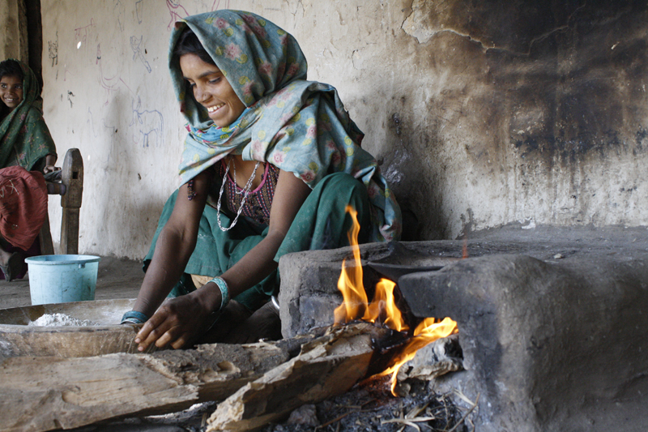

# Plausible impacts of air contamination on the health of the Global Population

## Introduction/Objectives

Air pollution is a very serious issue that the global population is currently dealing with. The abundance of air pollutants is not only contributing to global warming, but it is also causing problematic health issues to the population. There have been numerous efforts to protect and improve air quality across most nations. However, it seems that we are making very little progress. One of the main causes of this is the fact that the majority of air pollutants are derived from the burning of fossil fuels such as <em>coal</em>. Big industries and several other economical and political factors have slowed the progress towards the use of renewable energy by promoting the use of fossil fuels. Nevertheless, if we educate the general population and create awareness of this issue, we will be able to overcome this problem in the future.      

 They data gathered for this analysis are <em>raw</em> data provided by the <a href="https://www.who.int/">World Health Organization</a>, <a href="http://www.healthdata.org/">The Institute for Health Metrics and Evaluation</a> and the <a href="https://www.worldbank.org/">World Bank Group</a>.
 

## Business Problems
The task is to conduct data analysis, search for potential information, and create visualizations that can be used to reduce the amount of emitted pollutants across the globe.
## Analytical Context

 Given a folder, named <code>Data</code> with <em>raw</em> data. This data contains quite a large number of variables and it is in a fairly disorganized state. In addition, one of the datasets contains very poor documentation, segmented into several datasets. The objective will be to:

<ol>
<li>Extract and clean the relevant data. You will have to manipulate several datasets to obtain useful information for the case. </li>
<li>Conduct Exploratory Data Analysis. You will have to create meaningful plots, formulate meaningful hypotheses and study the relationship between various indicators related to air pollution.</li>
</ol>

Additionally, the client has some broad questions they would like to answer: 
1. Are we making any progress in reducing the amount of emitted pollutants across the globe? 
2. Which are the critical regions where we should start environmental campaigns? 
3. Are we making any progress in the prevention of deaths related to air pollution? 
4. Which demographic characteristics seem to correlate with the number of health-related issues derived from air pollution? 

## Methodologies
1. Extract and clean the relevant data by manipulating several datasets from <code>Data</code> folder to obtain useful information for the case 
2. Read, transform, and prepare data for visualization
3. Perform analytics and construct visualizations of the data to identify patterns in the dataset

## Environment, Tools and Libraries:
1.	Pandas for data manipulation 
2.	Numpy for mathematical calculation and analysis 
3.	Seaborn and Matplotlib for visualization and insights
4.	Python 3.9 Environment 
5.	Jupyter and Microsoft Excel as tools  

## Recommendation/Conclusion
After much data manipulation and visualization I arrived at these summary for preventive actions and patterns of accidents

1. There has been progress in reducing the amount of emitted pollutants across the globe as it was observed that from the beginning of second quarter of year 2010 , there have been major reduction in emitted pollutants across the globe.

2. According to the study, it was observed that the region listed below are dealing poorly with pollution, Hence the environmental campaign should be started from them:
The East Asia and Pacific, South Asian were the worst country dealing with pollutants emissions
North America, CO2 emmision increased immensely over years
Latin American and Carribean, and Sub-Saharan Africa are the critical regions where the environmental campaign should commence with.

3. The mortality rate was not properly recorded as it was shown that most of the year except 2016 had all their rows null. Therefore, there is no chance to estimate if there is any progress over the years.

4. Income Group is one of demographic characteristics which tends to correlate with the number of health-related issues related to air pollution. 